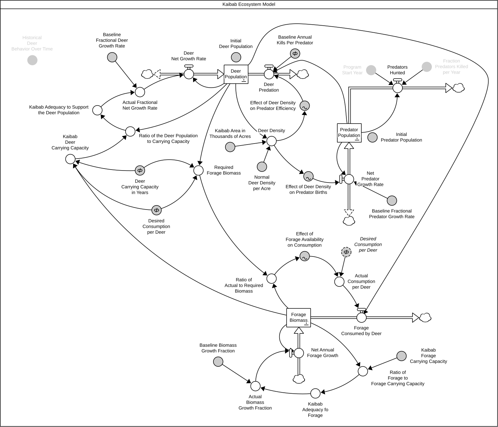
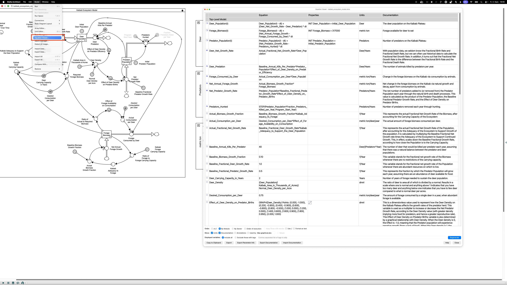
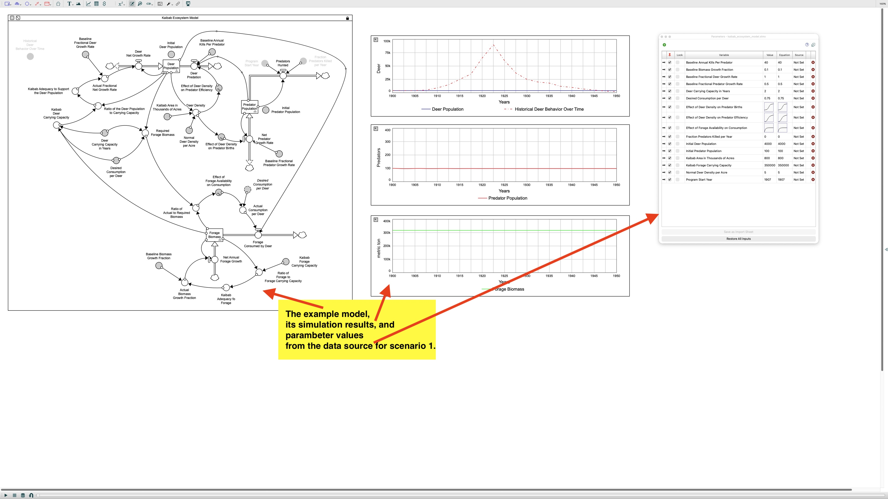
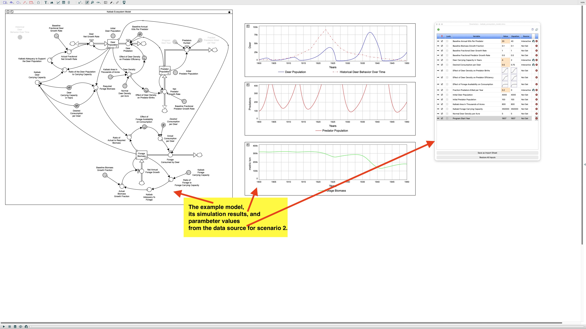

# The Kaibab ecosystem model

This is the example model used throughout **nfdi4sd**. It is here to show how to externalise parameters,
how to vary scenarios, and how to document the model development in git commits.

The model reproduces the collapse of the Kaibab mule deer herd between 1900 and 1950: predator
removal releases the herd from predation, the herd overshoots the carrying capacity of the
plateau's forage, forage biomass is depleted, and the herd crashes. It was chosen as the example
because it is a classic overshoot-and-collapse structure, small enough to read end to end, and
published under an open license.

## Source and attribution

This is a re-implementation of a model published in an open textbook:

> Deaton, M., & MacDonald, R. (2025). *System Dynamics Learning Guide*, Chapter 4:
> Introduction to System Dynamics Modeling, Section 4.11 "Putting it all Together: A Kaibab
> Ecosystem Model" (stock-and-flow structure: Figure 4.19; variable descriptions: Exhibit 4.11).
> James Madison University Libraries. <https://pressbooks.lib.jmu.edu/sdlearningguide/>
> Chapter: <https://pressbooks.lib.jmu.edu/sdlearningguide/chapter/chapter-4-introduction-to-system-dynamics-modeling/>

The original work is licensed **CC BY-NC-SA 4.0**. Any redistribution of this model, including
the model in the repository, inherits the ShareAlike and NonCommercial conditions of that license.
See the License section of [`../README.md`](../README.md).

## Structure

Three stocks, coupled through forage availability and predation:

| Stock | Unit | Inflow | Outflow |
|-------|------|--------|---------|
| `Deer Population` | deer | `Deer Net Growth Rate` | `Deer Predation` |
| `Forage Biomass` | metric tons | `Net Annual Forage Growth` | `Forage Consumed per Deer` |
| `Predator Population` | predators | `Net Predator Growth Rate` | `Predators Hunted` |

The three nonlinearities that drive the behaviour are table (lookup) functions, kept outside the
model source in `models/config/lookups/` so they can be varied without editing the model:

- `Effect of Forage Availability on Consumption`: how far below their desired intake deer feed
  when forage is scarce.
- `Effect of Deer Density on Predator Births`: predator reproduction as a function of prey density.
- `Effect of Deer Density on Predator Hunting Efficiency`: kills per predator as a function of
  prey density.

Predator removal is a policy switch: `Predators Hunted` is zero until `Program Start Year`, then
removes `Fraction Predators Killed per Year` of the predator stock annually.

The model structure is shown in [Image (pdf) of the example kaibab ecosystem model.](kaibab_ecosystem_model_stella.pdf) and below:

## Simulation settings

| Setting | Value |
|---------|-------|
| Time unit | years |
| Initial time | 1900 |
| Final time | 1950 |
| Time step (DT) | 1/20 year (0.05) |
| Integration method | RK2 (2nd-order Runge–Kutta) |

These settings are part of the model definition.

## Model Equations

All equations used in the model have been [documented and exported with Stella](kaibab_ecosystem_doc_stella_equations.txt).

## Default parameters

Baseline values as given in Exhibit 4.11. They can be found in `models/config/parameters/basic_parameters.csv` and in `models/config/parameters/initial_stock_parameters.xlsx`.  (For now, configurations for Stella are given in `kaibab_ecosystem_parameters_stella_scenario1.csv` and `kaibab_ecosystem_parameters_stella_scenario1.csv`.)

| Parameter | Value | Unit |
|-----------|-------|------|
| `Initial Deer Population` | 4 000 | deer |
| `Initial Predator Population` | 100 | predators |
| `Initial Forage Biomass` | 317 000 | metric tons |
| `Kaibab Forage Carrying Capacity` | 350 000 | metric tons |
| `Baseline Fractional Deer Growth Rate` | 1.0 | 1/year |
| `Baseline Fractional Predator Growth` | 0.5 | 1/year |
| `Baseline Biomass Growth Fraction` | 0.10 | 1/year |
| `Desired Consumption per Deer` | 0.75 | metric tons/(deer·year) |
| `Deer Carrying Capacity in Years` | 2 | years |
| `Baseline Annual Kills per Predator` | 40 | deer/(predator·year) |
| `Kaibab Area in Thousands of Acres` | 800 | thousand acres |
| `Normal Deer Density per Acre` | 5 | deer/thousand acres |
| `Program Start Year` | 1907 | year |
| `Fraction Predators Killed per Year` | 0 | 1/year |

With `Fraction Predators Killed per Year = 0` the predator-removal policy is inactive. The above parameters represent the baseline run (**case 1**). The overshoot-and-collapse trajectory appears once predators are removed from `Program Start Year` onwards (**case 2**, `models/config/scenarios/case2.cin`).

## Reference behaviour

`models/config/timeseries/historical_deer_botg.csv` holds the historical deer behaviour-over-time graph
(estimated deer population 1900–1950) that the simulated `Deer Population` is compared against.

## Simulation Results

The example provides configurations for two scenarios. The initial scenario is in equilibrium without intervention.

The [simulation results](../results/kaibab_ecosystem_results_stella_scenario1.csv) are exported into a `.csv` file in the `../results/` folder.

In the second scenario, an intervention -- hunting predators -- is introduced and disturbs the equilibrium.

The [simulation results](../results/kaibab_ecosystem_results_stella_scenario2.csv) are exported into a `.csv` file in the `../results/` folder.

